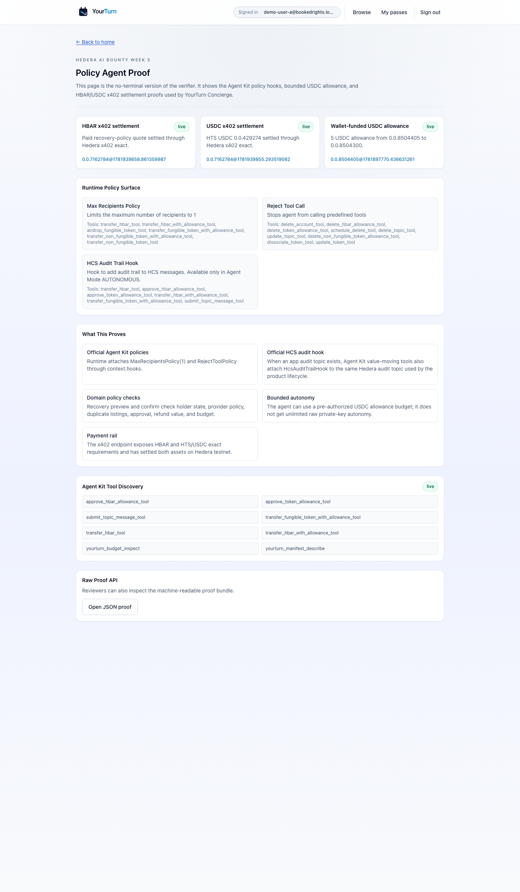
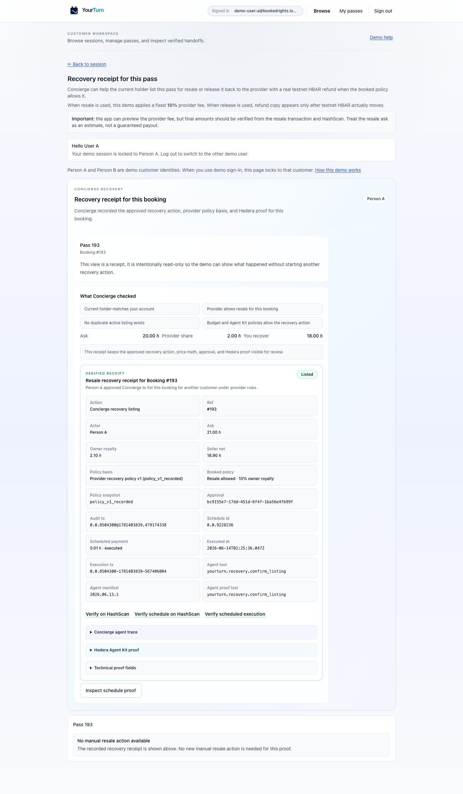
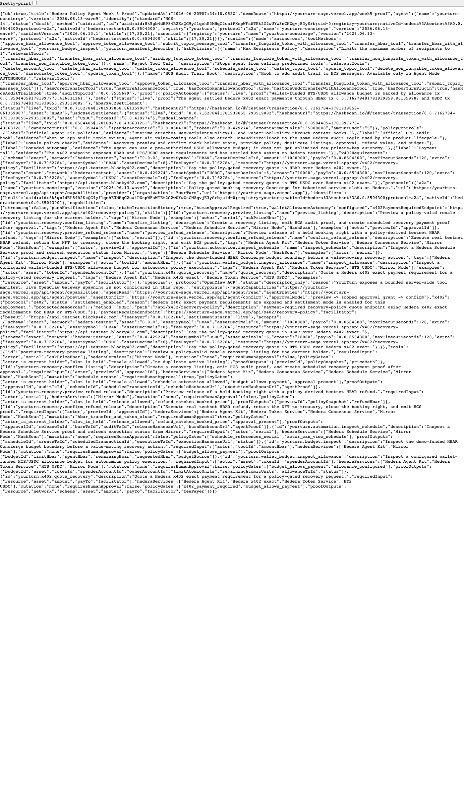

# YourTurn Concierge

YourTurn Concierge is a Hedera Policy Agent for booked service recovery. When a customer cannot attend a booked service slot, the agent can help recover value only if holder state, provider rules, budget policy, and explicit approval all pass.

Live demo: [https://yourturn-sage.vercel.app](https://yourturn-sage.vercel.app)

Week 5 proof page: [https://yourturn-sage.vercel.app/week5-proof](https://yourturn-sage.vercel.app/week5-proof)

## Hedera AI Bounty Week 5

This repository's active submission lane is:

**Week 5: Hedera Policy Agent**

The Week 5 claim is narrow:

> A provider sets recovery rules for a booked service slot. Person A cannot attend. YourTurn Concierge previews the allowed recovery action, blocks invalid actions, requires scoped approval or a bounded allowance budget, and returns Hedera proof for the action.

The implementation uses:

- `@hashgraph/hedera-agent-kit` v4
- Agent Kit `MaxRecipientsPolicy(1)`
- Agent Kit `RejectToolPolicy`
- Agent Kit `HcsAuditTrailHook`
- Hedera Token Service booking-right NFTs
- Hedera Consensus Service audit events
- Hedera Schedule Service payment proof
- Mirror Node and HashScan verification
- Hedera x402 exact payment requirements for HBAR and HTS/USDC
- Optional WalletConnect/Reown path for user-signed bounded USDC allowance
- Agent Lab and NFT Studio proof artifacts for reviewer inspection

## Screenshots

### Policy Agent Proof



### Concierge Recovery Receipt



### Machine-Readable Proof



## Reviewer Proof Links

Use these links for bounty review:

| Surface | URL |
| --- | --- |
| App demo | [https://yourturn-sage.vercel.app](https://yourturn-sage.vercel.app) |
| Week 5 proof page | [https://yourturn-sage.vercel.app/week5-proof](https://yourturn-sage.vercel.app/week5-proof) |
| Machine-readable proof | [https://yourturn-sage.vercel.app/api/agent/week5-proof](https://yourturn-sage.vercel.app/api/agent/week5-proof) |
| x402 HBAR/USDC policy endpoint | [https://yourturn-sage.vercel.app/api/x402/recovery-policy](https://yourturn-sage.vercel.app/api/x402/recovery-policy) |
| Wallet budget proof | [https://yourturn-sage.vercel.app/api/wallet-budget/config](https://yourturn-sage.vercel.app/api/wallet-budget/config) |
| NFT Studio metadata/risk proof | [https://yourturn-sage.vercel.app/api/nft-studio/proof](https://yourturn-sage.vercel.app/api/nft-studio/proof) |
| Agent card | [https://yourturn-sage.vercel.app/.well-known/agent.json](https://yourturn-sage.vercel.app/.well-known/agent.json) |
| Capabilities | [https://yourturn-sage.vercel.app/api/agent/capabilities](https://yourturn-sage.vercel.app/api/agent/capabilities) |

Required feedback issue:

- [hashgraph/hedera-agent-kit-js#940](https://github.com/hashgraph/hedera-agent-kit-js/issues/940)

## Demo Path

Fastest browser-only demo:

1. Open [https://yourturn-sage.vercel.app/login](https://yourturn-sage.vercel.app/login).
2. Sign in as **Demo user A**.
3. Open [https://yourturn-sage.vercel.app/resale/193?mode=recovery](https://yourturn-sage.vercel.app/resale/193?mode=recovery).
4. Show the Concierge recovery receipt and policy fields.
5. Open [https://yourturn-sage.vercel.app/week5-proof](https://yourturn-sage.vercel.app/week5-proof).
6. Open [https://yourturn-sage.vercel.app/api/agent/week5-proof](https://yourturn-sage.vercel.app/api/agent/week5-proof).

Recording script:

- [docs/HEDERA-WEEK5-DEMO-SCRIPT.md](docs/HEDERA-WEEK5-DEMO-SCRIPT.md)

Submission runbook:

- [docs/HEDERA-WEEK5-FINAL-STEPS.md](docs/HEDERA-WEEK5-FINAL-STEPS.md)

Submission copy and implementation details:

- [docs/HEDERA-AI-BOUNTY-WEEK5-POLICY-AGENT.md](docs/HEDERA-AI-BOUNTY-WEEK5-POLICY-AGENT.md)

## Verification

```bash
npm install
npm run hedera:agent-check
npm run build
npm run hedera:agent-lab-proof
npm run hedera:nft-studio-proof
npm run hedera:usdc-allowance-proof -- --status
npm run hedera:x402-settlement-proof -- --status
```

What this verifies:

- Agent Kit v4 runtime is present.
- `MaxRecipientsPolicy`, `RejectToolPolicy`, and `HcsAuditTrailHook` are configured.
- Multi-recipient transfers and destructive tools are blocked.
- YourTurn domain policies block invalid recovery actions.
- HBAR and USDC x402 requirements are exposed.
- Wallet-funded USDC allowance proof is configured.
- Agent Lab and NFT Studio packets are generated and valid.

To regenerate public screenshots:

```bash
npm run hedera:week5-capture -- --base-url=https://yourturn-sage.vercel.app --serial=193 --role=guestA --out=output/week5-proof-assets
```

The committed screenshots in `docs/week5-assets/` are selected from that output.

## Run Locally

```bash
npm install
cp .env.example .env.local
npm run dev
```

Open:

- `http://localhost:3000/login`
- Demo issuer: prepares provider slots.
- Demo user A: books and recovers a pass.
- Demo user B: buys a listed pass.

Required environment values are listed in [.env.example](.env.example). The live deployment uses Hedera testnet accounts, Upstash Redis, and optional Telegram bot settings.

## Claim Boundaries

Live and claimed:

- HTS booking-right NFTs
- HCS audit events
- Hedera Schedule Service recovery payment proof
- Real testnet HBAR refund/release proof
- Hedera x402 HBAR and HTS/USDC settlement proof
- Optional user-signed WalletConnect/Reown USDC allowance path
- Mirror Node and HashScan verification
- Agent Kit runtime/policy proof
- Agent Lab companion packet
- NFT Studio metadata/risk proof

Not claimed:

- Raw autonomous private-key custody
- Production fiat refunds
- Stablecoin onramp
- OpenClaw ACP gateway runtime
- Fully autonomous LLM negotiation
- Every app route as an Agent Kit BaseTool

## Historical Materials

The folder `docs/ethglobal-nyc-2026/` contains historical ETHGlobal continuity materials. For this bounty, use the Week 5 proof links and Week 5 docs above as the source of truth.
