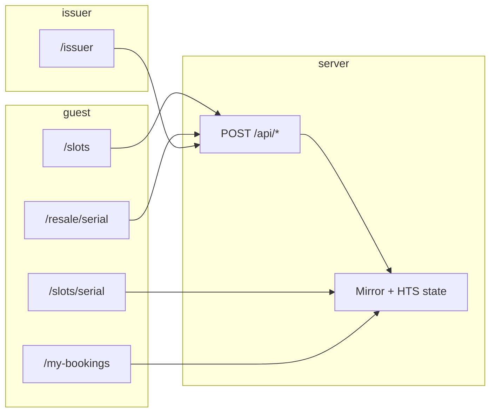

# UI map and flow index

Living map of **routes**, **React surfaces**, **API calls**, and **spec flows** (`F1`–`F7` from `docs/SPEC.md`). Use it for flow review, component tracking, and spotting gaps.

## How to use this doc

- **Before a product PR:** confirm the route row still matches the page and client component; add or adjust **APIs called** if you introduce new `fetch` targets.
- **Flow review:** walk `docs/DEMO.md` (happy path) and cross-check each step against the tables below.
- **“Does this have a purpose?”** If a new component has no route or parent, either document the exception here or fold it into an existing surface.

## When to update this doc (PR checklist)

Update **`docs/UI-MAP.md` in the same PR** when you change any of the following (so flow review and agent context stay accurate):

- A new or removed **App Router page** under `app/`, or a renamed route segment.
- A new or removed **client component** that calls `fetch` to `app/api/*`, or a changed API path / method from the browser.
- A new **`POST` / `GET` under `app/api/`** (add a row to the API table and set **Called from UI?** correctly).
- A **spec flow** (`F1`–`F7`) that gains or loses a user-visible step — align the **Spec flows** table and, if the happy path changes, **`docs/DEMO.md`**.

**PR description:** If the slice touched routes or APIs, add a short note such as: `Updated docs/UI-MAP.md` (or explain why it did not apply). This is repo policy; see **`AGENTS.md`** — read order and “After you finish a slice”.

## Routes → server page → UI → APIs

| Route | Server module | Renders | Client / child UI | User actions (primary) | APIs invoked from browser |
|-------|----------------|---------|-------------------|-------------------------|---------------------------|
| `/` | `app/page.tsx` | Marketing home | — (Server Component) | Navigate via links | — |
| `/login` | `app/login/page.tsx` | App sign-in | `DemoLoginButtons`, `LoginForm`, `LogoutToSwitchAccount` | Sign in as demo issuer / demo user A / demo user B, or sign in with email + password | `POST /api/auth/demo-login`, `POST /api/auth/login`, `POST /api/auth/logout` |
| `/register` | `app/register/page.tsx` | App registration | `RegisterForm` | Create a guest app account | `POST /api/auth/register` |
| `/slots` | `app/slots/page.tsx` | Customer browse list | `SlotsClient` | Signed-in guest sees a customer browse page; demo user A / B sign-ins lock the page to that customer; review and book an AVAILABLE slot | `POST /api/book` |
| `/slots/[serial]` | `app/slots/[serial]/page.tsx` | Shared truth page: status, next step, proof | `SlotResaleCta` (link only) | Open resale when eligible | — |
| `/my-bookings` | `app/my-bookings/page.tsx` | Customer pass hub | `MyBookingsClient` | Signed-in guest sees only their customer view; open details / resale, refresh | — (`router.refresh()` only) |
| `/resale/[serial]` | `app/resale/[serial]/page.tsx` | Customer resale handoff page | `ResaleClient` | Signed-in guest sees the seller / buyer side for their locked demo user; review and list at ask, review and buy listing | `POST /api/resale-list`, `POST /api/resale-buy` |
| `/issuer` | `app/issuer/page.tsx` | Provider dashboard shell | `IssuerPanel` | Signed-in issuer saves business name + 3-session plan, init, mint, typed-confirm reset, confirm freeze, reopen, typed-confirm mark used | `POST /api/session-plan`, `POST /api/init`, `POST /api/mint-slots`, `POST /api/reset-demo`, `POST /api/freeze`, `POST /api/unfreeze`, `POST /api/mark-used` |
| `/demo-help` | `app/demo-help/page.tsx` | In-app explanation of demo identities and confirm steps | — (Server Component) | Read how Person A / Person B / Provider map to the demo | — |
| `/brand-lab` | `app/brand-lab/page.tsx` | Logo variants first, then internal UI kit + homepage composites | `BrandLabClient`, `BrandLabUiKit`, `BrandLabAgentPrototype` | Switch logo direction chips; preview buttons, feedback, toasts, ActorSelector; **assistant-style prototype** (scripted routing, not an LLM) calls `/api/agent/read` + `/api/agent/preview` when “Live API” is on | — |
| `/brand-lab/assistant` | `app/brand-lab/assistant/page.tsx` | **Customer-only** conversation-shaped **prototype** (scripted routing, not an LLM); no internal column | `BrandLabAgentPrototype` (`mode="customerOnly"`) | Starter actions, preview/confirm cards; Person A + Live API defaults | — |
| `/brandlab` | `app/brandlab/page.tsx` | Redirect → `/brand-lab` (typo alias) | — | — | — |

Global chrome: `app/layout.tsx` + `components/SiteHeader.tsx` (header nav only; no API calls).

## Shared components

| Component | File | Role | Used on |
|-----------|------|------|---------|
| `ActorSelector` | `components/ActorSelector.tsx` | Demo persona switcher; compact Person A / Person B toggle on customer routes, with `lockTo` support when demo user A / B is signed in | `/slots`, `/my-bookings`, `/resale/*` |
| `SlotResaleCta` | `app/slots/[serial]/SlotResaleCta.tsx` | Link to `/resale/[serial]` | `/slots/[serial]` when resale allowed |
| `SiteHeader` | `components/SiteHeader.tsx` | Global product nav, session display, sign in / register / sign out actions | All routes via `app/layout.tsx` |
| `GuestPortalShell` | `components/GuestPortalShell.tsx` | Shared signed-in customer wrapper used by role-gated layouts | `/slots`, `/my-bookings`, `/resale/*` |
| `BrandLabClient` | `components/brand-lab/BrandLabClient.tsx` | Mock surfaces + switchable SVG logo directions for design review | `/brand-lab` only |
| `Button` | `components/ui/Button.tsx` | Shared action primitive with loading state and variants | Customer + provider action surfaces |
| `LiveFeedback` | `components/ui/LiveFeedback.tsx` | Shared success/error messaging | `/slots`, `/resale/[serial]`, `/issuer` |
| `Skeleton` | `components/ui/Skeleton.tsx` | Shared loading placeholder | Route-level `loading.tsx` files |

**Note:** `statusTone` / status copy helpers are duplicated across several files; consider one shared helper when touching styling (see prior review).

## Route loading states

| Route | Loading file | Purpose |
|-------|--------------|---------|
| `/slots` | `app/slots/loading.tsx` | Browse skeleton while sessions load |
| `/slots/[serial]` | `app/slots/[serial]/loading.tsx` | Detail/proof skeleton |
| `/my-bookings` | `app/my-bookings/loading.tsx` | Pass-hub skeleton |
| `/resale/[serial]` | `app/resale/[serial]/loading.tsx` | Resale handoff skeleton |
| `/issuer` | `app/issuer/loading.tsx` | Provider dashboard skeleton |

## API routes → purpose → typical caller

| API | Method | Purpose | Called from UI? |
|-----|--------|---------|-----------------|
| `/api/auth/demo-login` | POST | One-click demo issuer / user A / user B sign-in | Yes — Login |
| `/api/auth/login` | POST | Email + password sign-in | Yes — Login |
| `/api/auth/logout` | POST | End current app session | Yes — Header / login helpers |
| `/api/auth/me` | GET | Current signed-in app user | No — server/auth support |
| `/api/auth/register` | POST | Create guest app account | Yes — Register |
| `/api/init` | POST | Create/store token + topic ids | Yes — Issuer |
| `/api/session-plan` | POST | Save business name + 3 planned demo sessions used by mint/reset | Yes — Issuer |
| `/api/mint-slots` | POST | Seed slots in Redis (+ mint NFTs per demo policy) | Yes — Issuer |
| `/api/reset-demo` | POST | Reset demo state | Yes — Issuer |
| `/api/book` | POST | Primary booking (`F1`) | Yes — Slots list |
| `/api/resale-list` | POST | Create resale listing (`F2`) | Yes — Resale page |
| `/api/resale-buy` | POST | Buy active listing (`F2`) | Yes — Resale page |
| `/api/freeze` | POST | Freeze current holder (`F3`) | Yes — Issuer |
| `/api/unfreeze` | POST | Unfreeze (`F3`) | Yes — Issuer |
| `/api/mark-used` | POST | Mark used / burn path (`F4`) | Yes — Issuer |
| `/api/associate` | POST | Associate token to guest (same tx path as book can do inline) | **No** — manual / tooling; booking path may associate inside `POST /api/book` |
| `/api/mirror` | GET | Mirror debug / reads by query | **No** — tooling / scripts |
| `/api/agent/read` | POST | Agent-safe read surface over `BookingPort` (`listSlots`, `getSlot`, holdings, listings, lifecycle) | **No** — external agent / backend integration |
| `/api/agent/preview` | POST | Agent preview surface over `BookingPort` for `F1` / `F2` / `F3` / `F4` | **No** — external agent / backend integration |
| `/api/agent/confirm` | POST | Agent confirm surface; requires preview token + delegated approval grant | **No** — external agent / backend integration |
| `/api/agent/approval-grant` | POST | Mint scoped delegated approval grants; trusted backend only via secret header | **No** — backend tooling only |

## Spec flows (`docs/SPEC.md`) vs shipped UI

| Flow | Meaning | Where it shows up | Notes |
|------|---------|-------------------|--------|
| **F1** Primary booking | Guest books AVAILABLE slot | `/slots` → `POST /api/book` | Holder + tx feedback in UI |
| **F2** Resale + royalty | List and buy | `/resale/[serial]` | Seller and buyer both review a confirm dialog before the API call; royalty copy on page + `lib/domain/fees.ts` |
| **F3** Freeze / unfreeze | Issuer blocks movement | `/issuer` | Mirror holder must match `holderActor` (API enforced) |
| **F4** Mark used | Close lifecycle | `/issuer` → `POST /api/mark-used` | Typed confirm in provider dashboard; guest views update via Mirror on refresh |
| **F7** Cancel / refund | Not in MVP | — | Listed deferred in `docs/TASKS.md` |

## Where customer and provider “meet”

Both rely on the **same** on-chain + Mirror-derived status for a serial:

- **Customer** drives: book, list resale, buy resale (and reads detail / hub).
- **Provider** drives: seed, freeze/unfreeze, mark used.
- **Convergence:** serial `N` has one lifecycle; pages re-read state after `router.refresh()` or navigation. There is no separate “guest DB” vs “issuer DB” for ownership — Redis holds slot **metadata**; holder truth is chain + Mirror.

## Gap and orphan checklist

Use when auditing “are we missing something?”

| Item | Status |
|------|--------|
| F7 cancel / refund | Not built — see `docs/TASKS.md` |
| `POST /api/associate` in UI | Not linked — optional explicit associate for demos/debug |
| `GET /api/mirror` | Not linked from app — intentional tooling |
| `/api/agent/*` | Not linked from app — intentional agent/backend integration surface |
| Real tx proof lines | See `docs/TX-LOG.md`; re-run and extend after new testnet proof |
| Component inventory | This file — update when adding routes, `*Client.tsx`, shared app chrome, or route loading states |

## Surface split

- **Customer surfaces:** `/slots`, `/my-bookings`, `/resale/[serial]`
- **Shared truth surface:** `/slots/[serial]`
- **Provider surface:** `/issuer`

Keep that split visible in copy and controls. If a customer page starts explaining provider operations too early, it is drifting out of role.

## Related docs

- `docs/MARKET-VOCABULARY.md` — Web2 booking / class / ticket terminology vs our copy
- `docs/AGENT-INTEGRATION.md` — concrete backend and agent request / response examples for `/api/agent/*`
- `docs/DEMO.md` — shipped walkthrough
- `docs/INTERNAL.md` — local-only audits and checklists (`docs/internal/`, gitignored)

## Trust reminder (demo)

The browser still sends a demo **`actor`** for booking and resale actions, but those routes now also require a signed-in app session and enforce the locked demo user where applicable. This is still demo auth, not wallet auth. Security-sensitive checks (e.g. provider-only APIs, freeze vs Mirror holder, user A vs user B lock) live in **API routes**, not in client components. See `lib/auth/*`, `lib/validation/api.ts`, and individual `app/api/*/route.ts` files.
