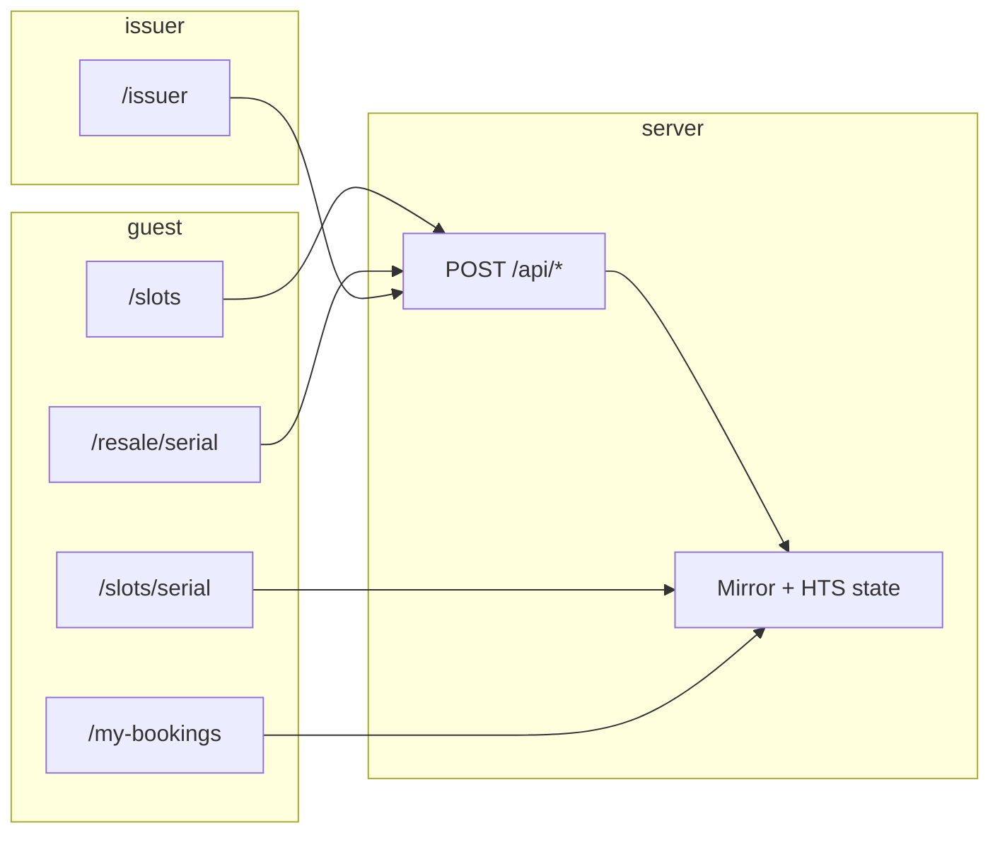

# UI map and flow index

Living map of **routes**, **React surfaces**, **API calls**, and **spec flows** (`F1`–`F7` from `docs/SPEC.md`). Use it for flow review, component tracking, and spotting gaps.

## How to use this doc

- **Before a product PR:** confirm the route row still matches the page and client component; add or adjust **APIs called** if you introduce new `fetch` targets.
- **Flow review:** walk `docs/DEMO.md` (happy path) and cross-check each step against the tables below.
- **“Does this have a purpose?”** If a new component has no route or parent, either document the exception here or fold it into an existing surface.

## When to update this doc (PR checklist)

Update **`docs/UI-MAP.md` in the same PR** when you change any of the following (so flow review and agent context stay accurate):

- A new or removed **App Router page** under `app/`, or a renamed route segment.
- A new or removed **client component** that calls `fetch` to `app/api/*`, or a changed API path / method from the browser.
- A new **`POST` / `GET` under `app/api/`** (add a row to the API table and set **Called from UI?** correctly).
- A **spec flow** (`F1`–`F7`) that gains or loses a user-visible step — align the **Spec flows** table and, if the happy path changes, **`docs/DEMO.md`**.

**PR description:** If the slice touched routes or APIs, add a short note such as: `Updated docs/UI-MAP.md` (or explain why it did not apply). This is repo policy; see **`AGENTS.md`** — read order and “After you finish a slice”.

## Routes → server page → UI → APIs

| Route | Server module | Renders | Client / child UI | User actions (primary) | APIs invoked from browser |
|-------|----------------|---------|-------------------|-------------------------|---------------------------|
| `/` | `app/page.tsx` | Marketing home | — (Server Component) | Navigate via links | — |
| `/slots` | `app/slots/page.tsx` | Public slot list | `SlotsClient` | Choose guest actor, book an AVAILABLE slot | `POST /api/book` |
| `/slots/[serial]` | `app/slots/[serial]/page.tsx` | Slot detail, status, HCS snippet | `SlotResaleCta` (link only) | Open resale when eligible | — |
| `/my-bookings` | `app/my-bookings/page.tsx` | Hub for selected guest | `MyBookingsClient` | Switch actor, open details / resale, refresh | — (`router.refresh()` only) |
| `/resale/[serial]` | `app/resale/[serial]/page.tsx` | Resale headline + fee copy | `ResaleClient` | List at ask, buy listing | `POST /api/resale-list`, `POST /api/resale-buy` |
| `/issuer` | `app/issuer/page.tsx` | Issuer console shell | `IssuerPanel` | Init, mint, reset, freeze/unfreeze, mark used | `POST /api/init`, `POST /api/mint-slots`, `POST /api/reset-demo`, `POST /api/freeze`, `POST /api/unfreeze`, `POST /api/mark-used` |

Global chrome: `app/layout.tsx` (header nav only; no API calls).

## Shared components

| Component | File | Role | Used on |
|-----------|------|------|---------|
| `ActorSelector` | `components/ActorSelector.tsx` | Demo actor (`issuer` / `guestA` / `guestB`), persists choice in `localStorage` | `/slots`, `/my-bookings`, `/resale/*`, `/issuer` |
| `SlotResaleCta` | `app/slots/[serial]/SlotResaleCta.tsx` | Link to `/resale/[serial]` | `/slots/[serial]` when resale allowed |

**Note:** `statusTone` / status copy helpers are duplicated across several files; consider one shared helper when touching styling (see prior review).

## API routes → purpose → typical caller

| API | Method | Purpose | Called from UI? |
|-----|--------|---------|-----------------|
| `/api/init` | POST | Create/store token + topic ids | Yes — Issuer |
| `/api/mint-slots` | POST | Seed slots in Redis (+ mint NFTs per demo policy) | Yes — Issuer |
| `/api/reset-demo` | POST | Reset demo state | Yes — Issuer |
| `/api/book` | POST | Primary booking (`F1`) | Yes — Slots list |
| `/api/resale-list` | POST | Create resale listing (`F2`) | Yes — Resale page |
| `/api/resale-buy` | POST | Buy active listing (`F2`) | Yes — Resale page |
| `/api/freeze` | POST | Freeze current holder (`F3`) | Yes — Issuer |
| `/api/unfreeze` | POST | Unfreeze (`F3`) | Yes — Issuer |
| `/api/mark-used` | POST | Mark used / burn path (`F4`) | Yes — Issuer |
| `/api/associate` | POST | Associate token to guest (same tx path as book can do inline) | **No** — manual / tooling; booking path may associate inside `POST /api/book` |
| `/api/mirror` | GET | Mirror debug / reads by query | **No** — tooling / scripts |

## Spec flows (`docs/SPEC.md`) vs shipped UI

| Flow | Meaning | Where it shows up | Notes |
|------|---------|-------------------|--------|
| **F1** Primary booking | Guest books AVAILABLE slot | `/slots` → `POST /api/book` | Holder + tx feedback in UI |
| **F2** Resale + royalty | List and buy | `/resale/[serial]` | Royalty copy on page + `lib/domain/fees.ts` |
| **F3** Freeze / unfreeze | Issuer blocks movement | `/issuer` | Mirror holder must match `holderActor` (API enforced) |
| **F4** Mark used | Close lifecycle | `/issuer` → `POST /api/mark-used` | Guest views update via Mirror on refresh |
| **F7** Cancel / refund | Not in MVP | — | Listed deferred in `docs/TASKS.md` |

## Where guest and issuer “meet”

Both rely on the **same** on-chain + Mirror-derived status for a serial:

- **Guest** drives: book, list resale, buy resale (and reads detail / hub).
- **Issuer** drives: seed, freeze/unfreeze, mark used.
- **Convergence:** serial `N` has one lifecycle; pages re-read state after `router.refresh()` or navigation. There is no separate “guest DB” vs “issuer DB” for ownership — Redis holds slot **metadata**; holder truth is chain + Mirror.

## Gap and orphan checklist

Use when auditing “are we missing something?”

| Item | Status |
|------|--------|
| F7 cancel / refund | Not built — see `docs/TASKS.md` |
| `POST /api/associate` in UI | Not linked — optional explicit associate for demos/debug |
| `GET /api/mirror` | Not linked from app — intentional tooling |
| Real tx proof lines | Fill `docs/TX-LOG.md` when running testnet proofs |
| Component inventory | This file — update when adding routes or `*Client.tsx` |

## Related docs

- `docs/DEMO.md` — shipped walkthrough
- `docs/PERSONAS-EXPECTATIONS.md` — each stakeholder’s expectations vs what is available

## Trust reminder (demo)

The browser sends a demo **`actor`**; the server maps it to env-configured keys. This is **not** end-user authentication. Security-sensitive checks (e.g. freeze vs Mirror holder) live in **API routes**, not in client components. See `lib/validation/api.ts` and individual `app/api/*/route.ts` files.
