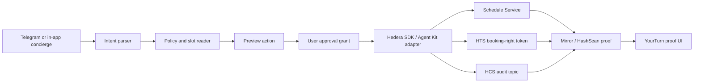

# ETH NYC 2026 Agent Automation Integration Plan

Date: 2026-06-13
Repo: `/Users/devinsonpena/yourturn`
Working name: YourTurn Concierge

## Source Intent From ETHGlobal Folder

This plan inherits the prior ETHGlobal product work rather than replacing it.

Primary source docs reviewed:

- `/Users/devinsonpena/ETHGlobal/docs/ethglobal-nyc-2026/yourturn-continuity-agent-plan-2026-06-12.md`
- `/Users/devinsonpena/ETHGlobal/docs/strategy/hedera-booked-rights-product-spec.md`
- `/Users/devinsonpena/ETHGlobal/docs/strategy/hedera-booked-rights-user-flows.md`
- `/Users/devinsonpena/ETHGlobal/docs/strategy/hedera-booked-rights-e2e-gap-fill.md`
- `/Users/devinsonpena/ETHGlobal/docs/strategy/hedera-booked-rights-modularity-tamper-evidence.md`
- `/Users/devinsonpena/ETHGlobal/docs/research/hedera-booked-rights-hedera-research-and-security.md`

Canonical intent:

> The base app proves tokenized booked rights. The hackathon feature should prove policy-aware recovery when life changes.

In flow terms, the new work is F6 + F7:

- F6: Agent concierge that proposes actions and never executes without approval.
- F7: Self-serve cancel/refund/release path that can end the booking right and return value according to issuer policy.

Schedule Service is the strongest extension of F7, not a separate product direction.

## Decision

The strongest Hedera-aligned hackathon delta is an approval-gated concierge that can prepare, approve, schedule, and prove a booking-right action.

Target proof:

1. A user asks the concierge to automate a real booking-right action.
2. The concierge reads the booking policy and network state.
3. The concierge previews the proposed action.
4. The user approves it.
5. The system creates a Hedera scheduled transaction on testnet.
6. The network executes the scheduled transaction.
7. YourTurn records HCS audit events and shows Mirror or HashScan proof.

This is stronger than adding a generic chat assistant because the live state changes on Hedera.

## Partner Eligibility Meaning

"Partner eligibility" means whether the project satisfies a specific sponsor prize's qualification requirements, not whether the project can submit to ETHGlobal at all.

For Hedera:

- Hedera is one partner selection in the ETHGlobal submission form.
- Hedera has multiple tracks under that partner.
- A project should only claim the tracks it can prove with working testnet evidence.
- Continuity Track is allowed for the Hedera Autonomous On-Chain Automation Platform prize because that prize explicitly says it is only available to Continuity Track participants.
- Other Hedera tracks can still be eligible if the new hackathon work satisfies their requirements, but we should not assume eligibility without proof.

Practical rule: select Hedera only if the final repo and demo can show the required Hedera flows. Within Hedera, claim Automation first, then Agentic Payments and No Solidity only if the implementation meets their exact bars.

## What AgentOps/OpenClaw Gives Us

AgentOps has useful prior work. For hackathon purposes, treat it as reusable operating design plus local evidence for safe Telegram-style agent boundaries.

Reusable:

- Telegram allowlisted ingress pattern.
- Explicit capture and command boundaries.
- No automatic external side effects by default.
- Human approval gate before mutating systems or sending external messages.
- Local durable capture artifacts and reviewable audit records.
- OpenClaw as a possible runtime/channel layer if ACP is available in the active session.
- A prior shape for explicit human approval before external side effects.
- A useful pattern for separating chat ingress from execution authority.

Still to build in YourTurn:

- No finished YourTurn Telegram bot.
- No proven YourTurn booking-right command grammar.
- No existing production path from Telegram/OpenClaw into YourTurn payment, transfer, or schedule execution.
- No evidence yet that OpenClaw ACP is active and usable for this hackathon workspace.

That is normal hackathon scope. Use the AgentOps work to accelerate the safe design, then build the actual YourTurn execution path in this repo.

## Official Hedera Docs Implications

Schedule Service:

- `ScheduleCreateTransaction` creates a schedule entity.
- The receipt includes a schedule ID and a scheduled transaction ID.
- Scheduled transactions can execute when required signatures are collected, or at expiry depending on configuration.
- Scheduled transactions can last up to two months.
- Supported scheduled transactions include transfers, token mint or burn, account updates, and contract execution.
- If there is no admin key, the schedule cannot be deleted.

Agent Kit:

- Hedera Agent Kit v4 is modular and supports policies and hooks.
- It can be used with agent frameworks, or as a lower-level toolkit.
- It includes tooling around HTS, HCS, transaction scheduling, and approvals.
- RETURN_BYTES mode can support human-in-the-loop flows where an agent prepares transaction bytes and the user executes elsewhere.

OpenClaw ACP:

- ACP should only be claimed if the runtime reports ACP enabled, dispatch allowed, backend loaded, and no sandbox block.
- If ACP is not active, we can still satisfy Hedera's agentic requirement through Hedera Agent Kit or direct Hedera SDK usage, but should not market it as OpenClaw ACP.

HCS-14:

- HCS-14 can give the agent a stronger on-chain identity story using DID-style agent identifiers.
- This is optional polish, not MVP.

## Proposed Architecture

Keep the execution adapter server-side. Telegram/OpenClaw should never hold operator keys.

## MVP Scenario

Recommended scenario: "I cannot make it" recovery flow.

Example:

- Holder has a transferable booking right.
- Holder tells YourTurn Concierge: "I cannot make Saturday."
- Concierge reads holder state, provider policy, open replacement slots, and resale eligibility.
- Concierge ranks recovery options: resale, rebook, cancel/release.
- Concierge shows a preview with fees, refund/resale amount, irreversible effects, and proof objects.
- Holder approves.
- System executes one real Hedera lifecycle action.
- If feasible, system creates a Hedera scheduled transaction for cancel/release/refund.
- HCS logs the agent observation, preview, approval, schedule creation or action execution, and execution result.
- Slot page and provider dashboard show status, tx id, schedule id if present, and proof links.

Fallback if token transfer/burn scheduling is blocked:

- Schedule a small HBAR transfer between demo accounts as the financial operation.
- Bind it to a booking-right workflow in the UI and HCS audit trail.
- Keep this as fallback only because the strongest demo changes the booking right itself.

Fallback if Schedule Service blocks:

- Ship the non-scheduled F6/F7 flow: agent-assisted resale listing, cancel/release, or rebook using existing Hedera execution paths.
- Claim AI & Agentic Payments and No Solidity if those proof bars are met.
- Do not claim Automation unless a real Schedule Service schedule id and executed scheduled transaction exist.

## Bounty Fit

## Current Implementation Status

Shipped on 2026-06-13:

- In-app Concierge recovery previews and confirms a policy-valid resale listing.
- Confirm creates an approval-scoped recovery receipt, an Agent Kit-guided trace, and a Hedera Schedule Service payment proof.
- The scheduled transaction is a `0.01` HBAR recovery payment from the approving demo holder to treasury, created with `waitForExpiry=true`.
- The UI can inspect the schedule proof and update status from Mirror to `executed`.
- In-app Concierge release/refund previews and confirms a real testnet HBAR refund, NFT return to treasury, close/burn, and HCS `CANCEL_RELEASED` audit event.
- Telegram Concierge webhook command handling is implemented and fixture-tested with mutation disabled unless an allowlisted live chat is configured.
- Latest clean scripted proof: schedule `0.0.9227051`, executed transaction `0.0.8504300-1781393179-807048329`, executed timestamp `1781393275.186272004`, refund/release transfer `0.0.8504300@1781393158.862791239`, refund close/burn `0.0.8504300@1781393162.787231448`, refund audit `0.0.8504300@1781393166.653109817`. Run `npm run ethglobal:e2e` to reproduce the full reset, refund/release, recovery, schedule, resale, and mark-used regression.

Still not shipped:

- Live Telegram credentials and allowlisted chat proof.
- OpenClaw transport.
- Wallet/onramp budget loading.
- Scheduled release/refund/expiry of the booking right itself.
- Fully autonomous LLM or multi-agent negotiation. The live path is a bounded Concierge workflow with an Agent Kit-guided trace and explicit human approval.

Claim boundary: say "Agent Kit-guided Concierge trace and scheduled recovery payment" unless a later wave wires a full LLM/Telegram/OpenClaw runtime.

Primary: Autonomous On-Chain Automation Platform

Required proof:

- Use Hedera Schedule Service on testnet.
- User-facing create, approve, and manage flow.
- At least one real future or conditional transaction executes end to end.
- README explains setup, architecture, and scheduling flow.
- Demo video shows creation and network execution.

Secondary: AI and Agentic Payments on Hedera

Required proof:

- The concierge behaves as an AI agent or bounded agentic workflow.
- It executes at least one payment, token transfer, or financial operation on Hedera testnet.
- Demo shows autonomous payment/action behavior after user approval.

Secondary: No Solidity Allowed

Required proof:

- Use Hedera SDKs only.
- Use at least two native services, ideally Schedule Service + HCS + HTS/Mirror.
- No Solidity smart contracts.

Tokenization:

- Existing YourTurn already uses HTS booking-right NFTs and royalties.
- Only claim this if the hackathon delta adds new token lifecycle functionality substantial enough to be judged as new work.

## Build Order

1. Mark the current repo state as the pre-existing continuity baseline.
2. Productize the Concierge read and preview layer over existing agent-safe APIs.
3. Implement option ranking for resale, rebook, and cancel/release.
4. Implement one real F7 execution path.
5. Add HCS audit events for agent observation, recommendation, approval, schedule creation, and execution.
6. Prove a standalone scheduled transaction script against Hedera testnet if pursuing Automation.
7. Add a server-side schedule adapter with idempotency and proof capture.
8. Add UI proof display for pending/executed schedules.
9. Add Telegram or OpenClaw ingress after the in-app path works, unless Telegram credentials are already cleanly available.
10. Update README, demo docs, UI map, and submission checklist.

## Guardrails

- Require an explicit user approval grant before any Hedera mutation.
- Use an action allowlist; no arbitrary transaction construction from chat text.
- Do not store private keys in Telegram, OpenClaw, browser storage, or HCS messages.
- Store only non-sensitive audit references in HCS.
- Add idempotency keys for schedule creation.
- Show cost, status, schedule ID, scheduled transaction ID, and proof links before claiming success.
- If OpenClaw ACP is used, document ACP readiness checks in the README.

## Demo Video Timing

Do not record the public demo until the schedule execution and proof UI work. The video is a packaging step after the integration scenario is real.
