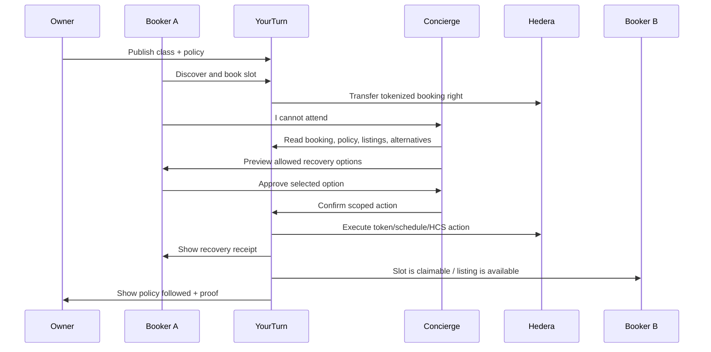

# ETHGlobal implementation plan

Status: build plan for the next waves.
Date: 2026-06-13.

This plan turns the competitor UX research and live YourTurn delta report into an implementation sequence for the ETHGlobal NYC 2026 Continuity Track.

The priority is not "add every feature." The priority is to make one winner-grade loop feel premium, work end to end, and produce Hedera proof.

## Operating Frame

Use the Hackathon OS gate:

```txt
anchor user -> proof moment -> smallest build -> demoable evidence -> closeout
```

Winner-grade target:

```txt
primitive -> proof object -> verifier -> reusable surface -> live state change -> polished demo
```

Our primitive:

- a tokenized booking right governed by owner policy

Our proof object:

- a recovery receipt containing booking id, policy snapshot, approval, Hedera tx ids, HCS event ids, and optional Schedule Service ids

Our verifier:

- app proof drawer plus HashScan/Mirror links, with a future CLI/script verifier if time allows

Our live state change:

- Booker A recovers a booking they cannot use; the booking state changes on Hedera and the app reflects it

Our polished demo:

- ClassPass/Mindbody-style booking experience with Hedera hidden as verified infrastructure

## Anchor Demo

Primary demo under 3 minutes:



## Build Principles

1. Fix trust breaks before adding features.
   - `/my-bookings` runtime error is a P0.

2. Productize the route the judge will watch.
   - `/slots`, `/slots/[serial]`, `/my-bookings`, `/resale/[serial]`, and `/issuer` matter more than new standalone pages.

3. Hide Web3 until it is useful.
   - Show "Verified receipt" first.
   - Put HashScan/HCS/Mirror details inside a proof drawer.

4. Make owner policy the source of truth.
   - The owner sets the rule.
   - The booking snapshots the rule.
   - The Concierge follows the rule.
   - Hedera proves the result.

5. Keep agent authority bounded.
   - Read -> recommend -> preview -> approve -> execute -> receipt.
   - No arbitrary chat-to-transaction path.

## Implementation Waves

### Wave 1: Stability And Premium Shell

Goal:

- Make the current app demo-safe and visually coherent before adding new technical depth.

User value:

- A judge can browse, inspect bookings, and understand the app without seeing runtime errors or console overlays.

Scope:

- Fix `/my-bookings` runtime error.
- Promote useful `/brand-lab` visual patterns into shipped routes.
- Establish common class/provider data shape for richer cards and details.
- Keep all existing Hedera behavior intact.

Files likely touched:

- `app/my-bookings/page.tsx`
- `app/my-bookings/MyBookingsClient.tsx`
- `app/slots/SlotsClient.tsx`
- `app/slots/[serial]/page.tsx`
- `app/resale/[serial]/ResaleClient.tsx`
- `components/GuestPortalShell.tsx`
- `components/SlotDetailStickyBar.tsx`
- `components/slots/SlotPassHeroCard.tsx`
- `components/brand-lab/*` as reference only
- `docs/UI-MAP.md`
- `docs/DEMO.md`

Implementation detail:

- First isolate and fix the undefined component/import causing the `/my-bookings` error.
- Add a shared premium shell for customer routes:
  - search/header zone
  - route-level content width
  - compact persona/demo helper
  - proof/trust drawer pattern
- Add seeded display metadata to existing slot rows:
  - studio/provider name
  - service category
  - instructor/staff
  - duration
  - location/neighborhood
  - amenities/preparation copy
  - seeded rating/review count
  - image asset or gradient-safe placeholder

Exit criteria:

- `npm run build` passes.
- `/slots`, `/my-bookings`, `/slots/164`, `/resale/164`, `/issuer` render with no Next/runtime overlay.
- Desktop and mobile screenshots captured.
- `docs/UI-MAP.md` and `docs/DEMO.md` still match the routes.

Tests:

- `npx tsc --noEmit`
- `npm run build`
- Browser screenshot pass:
  - desktop `/slots`
  - desktop `/my-bookings`
  - desktop `/slots/164`
  - desktop `/resale/164`
  - desktop `/issuer`
  - mobile `/slots`
  - mobile `/my-bookings`

### Wave 2: Marketplace Browse

Goal:

- Make `/slots` feel like a premium ClassPass-style discovery surface instead of a status table.

User value:

- Booker can quickly answer: "What can I book, when, where, and under what rules?"

Scope:

- Redesign `/slots` around discovery and booking cards.
- Add filters and tabs as local UI state first; do not overbuild backend search.
- Keep existing `POST /api/book` behavior.

Files likely touched:

- `app/slots/SlotsClient.tsx`
- `app/slots/page.tsx`
- possible new components:
  - `components/marketplace/SearchBar.tsx`
  - `components/marketplace/FilterChips.tsx`
  - `components/marketplace/SlotCard.tsx`
  - `components/marketplace/MarketplaceStats.tsx`

Implementation detail:

- Add top search strip:
  - activity/service search
  - location
  - date
  - time
  - category
  - policy badges
- Add ClassPass-like tabs:
  - Classes
  - Studios / Providers
- Replace raw list rows with rich cards:
  - title
  - provider
  - time and duration
  - category
  - location
  - price/budget
  - rating/trust signal
  - policy chips: resale allowed, release allowed, verified
  - primary CTA: Book or Details
- Keep lifecycle state available but not dominant.

Exit criteria:

- Booker can find an available slot and book it from the premium browse page.
- Held/used states are understandable without raw technical language.
- Mobile scanability is acceptable.

Tests:

- Book an available slot in a seeded/demo-safe state.
- Confirm the slot moves from `AVAILABLE` to held state.
- Confirm `/my-bookings` shows the pass after refresh.
- Screenshot desktop and mobile before/after booking.

### Wave 3: Class Detail, Ticket, And Proof Drawer — Verified Recovery Receipt + Policy Proof

Goal:

- Make the Wave 2 recovery action easy to prove, explain, and refresh.

User value:

- Booker and judge can see what happened, who approved it, what provider rule allowed it, and where the Hedera audit trail lives.

Scope:

- Add a reusable verified receipt/proof card.
- Persist demo recovery proof metadata so refresh does not erase the explanation.
- Reframe slot detail around verified lifecycle proof.
- Keep raw technical details collapsed by default.

Files likely touched:

- `app/slots/[serial]/page.tsx`
- `app/resale/[serial]/page.tsx`
- `app/resale/[serial]/ResaleClient.tsx`
- `components/concierge/RecoveryConciergePanel.tsx`
- possible new components:
  - `components/proof/RecoveryProofCard.tsx`
  - `lib/store/recovery-receipts.ts`

Implementation detail:

- Proof:
  - recovery listing receipt
  - active listing proof after refresh
  - resale-completed proof after buyer takeover
  - lifecycle timeline on slot detail
  - raw HCS event fields collapsed by default
- Policy basis:
  - use `slot.resaleAllowed` only until richer policy state exists
- Persistence:
  - store demo proof receipts in Redis
  - reset receipts during demo reset

Exit criteria:

- A non-technical judge can explain the recovery listing and resale handoff before seeing raw HashScan.
- A technical judge can inspect proof fields and verifier links in one click.

Tests:

- Approve recovery listing and see verified receipt.
- Refresh `/resale/[serial]` and confirm proof state remains visible.
- Buy listing as the other user.
- Open `/slots/[serial]` and confirm lifecycle proof shows booked/listed/resold.
- Render used/blocked pass and confirm recovery remains disabled.

### Wave 2b: Recovery Flow And In-App Concierge

Goal:

- Convert resale/release into the core hackathon product moment: "I cannot attend, help me recover value."

User value:

- Booker A can ask for help, see policy-valid options, approve one, and receive a proof receipt.

Scope:

- Add in-app Concierge panel first.
- Use existing BookingPort preview/approval/confirm mechanics through browser-safe recovery endpoints.
- Generate a recovery receipt artifact.
- Do not wait for Telegram before this works.
- Keep `cancel_release`, Telegram, and wallet funding out of this wave. Schedule Service proof was added in the later automation slice and is now attached to approved recovery receipts.

Files likely touched:

- `app/resale/[serial]/ResaleClient.tsx`
- `app/api/recovery/preview/route.ts`
- `app/api/recovery/confirm/route.ts`
- `components/concierge/RecoveryConciergePanel.tsx`
- `lib/validation/api.ts`
- possible new files:
  - `lib/agent/recovery-receipt.ts`

Implementation detail:

- New UI entry:
  - `/slots/[serial]` held pass has "Recover this booking"
  - `/my-bookings` held pass has "Ask Concierge"
- Concierge flow:
  1. Read booking and holder.
  2. Read policy snapshot.
  3. Read active listing state.
  4. Recommend resale if owner allows resale and current holder matches.
  5. Show preview with effect, fee, explicit approval, and proof target.
  6. Ask for approval.
  7. Create the listing through BookingPort.
  8. Show receipt.

MVP action:

- Use resale listing as the first end-to-end action.
- Do not call it a refund unless value actually moves back.

Exit criteria:

- One complete recovery receipt exists.
- Receipt includes approval id, action, serial, HCS listing audit tx, and verifier link when available.
- UI state changes after action.

Tests:

- Unit-ish function check for recommendation ranking.
- API checks:
  - read
  - preview
  - approval grant
  - confirm
- Browser flow:
  - held booking -> recover -> preview -> approve -> receipt
- `npm run build`

### Wave 5: Owner Policy Builder

Goal:

- Make the owner side visibly responsible for the automation rules.

User value:

- Owner controls which slots can be resold, released, waitlisted, or scheduled, and sees proof when those rules are followed.

Scope:

- Add policy controls to `/issuer`.
- Snapshot policy onto bookings.
- Show policy snapshot to bookers.

Files likely touched:

- `app/issuer/IssuerPanel.tsx`
- `app/api/session-plan/route.ts`
- `app/api/mint-slots/route.ts`
- `app/api/book/route.ts`
- `lib/store/slots.ts`
- `lib/types/*`
- possible new files:
  - `lib/policy/policy.ts`
  - `lib/policy/policy-snapshot.ts`
  - `components/owner/PolicyBuilder.tsx`
  - `components/owner/OwnerEconomicsPanel.tsx`

Implementation detail:

- Policy fields:
  - resale allowed
  - release allowed
  - waitlist enabled
  - refund label disabled unless payment refund exists
  - release cutoff
  - resale fee / owner royalty
  - scheduled automation enabled
- Snapshot rule:
  - booking stores policy version/hash at acquisition time
  - UI displays "Policy active when you booked"
- Owner dashboard:
  - show booked/held/released/resold/waitlisted/revenue/proof

Exit criteria:

- Owner can set policy before minting/publishing.
- Booker sees the policy snapshot during booking/detail/recovery.
- Concierge reads policy and blocks disallowed actions.

Tests:

- Policy disallows resale -> Concierge does not offer resale.
- Policy allows resale -> Concierge offers resale.
- Policy snapshot remains stable after owner changes future policy.

### Wave 6: Hedera Schedule Service Automation

Status: shipped for the approved recovery payment path on 2026-06-13. The cleaner future variant is scheduled release/refund/expiry, but that is not required for the current proof.

Goal:

- Qualify for the Continuity-only Hedera Autonomous On-Chain Automation Platform track.

User value:

- Owner/user can schedule a future or conditional booking-right action without off-chain cron.

Scope:

- Add a narrow Schedule Service path.
- Do not make it broad.
- Best target: scheduled release or scheduled HBAR/token transfer bound to a booking recovery action.
- Implemented target: scheduled `0.01` HBAR recovery payment from the approving demo holder to treasury, bound to the Concierge recovery listing receipt.

Files likely touched:

- `lib/hedera/schedule.ts`
- `lib/agent/concierge-agent.ts`
- `lib/store/automation-proofs.ts`
- `app/api/recovery/confirm/route.ts`
- `app/api/automation/inspect/route.ts`
- `components/proof/RecoveryProofCard.tsx`
- `components/concierge/RecoveryConciergePanel.tsx`

Implementation detail:

- First build a standalone schedule spike:
  - create schedule
  - capture schedule id
  - capture scheduled transaction id
  - execute/sign as needed
  - verify via Mirror/HashScan
- Then connect to product:
  - owner enables scheduled release
  - Concierge previews scheduled action
  - user approves
  - app creates schedule
  - UI shows pending/executed
  - HCS logs schedule lifecycle

Exit criteria:

- Real Hedera testnet schedule id.
- Real scheduled transaction execution.
- UI shows schedule state and proof.
- README explains setup and verification.

Current proof:

- Script verifier: `npm run ethglobal:e2e`
- Schedule id: `0.0.9227051`
- Scheduled transaction id: `0.0.8504300@1781393179.807048329?scheduled`
- Executed transaction id: `0.0.8504300-1781393179-807048329`
- Executed timestamp: `1781393275.186272004`
- Refund/release transaction id: `0.0.8504300@1781393158.862791239`
- Refund close/burn transaction id: `0.0.8504300@1781393162.787231448`
- Recovery receipt screenshot: `/tmp/yourturn-ethglobal-qa/recovery-178-completed-proof.png`
- Refund receipt screenshot: `/tmp/yourturn-ethglobal-qa/recovery-179-refund-proof.png`
- Provider proof screenshot: `/tmp/yourturn-ethglobal-qa/issuer-178-179-proof.png`
- HashScan schedule: `https://hashscan.io/testnet/schedule/0.0.9227051`
- HashScan scheduled execution: `https://hashscan.io/testnet/transaction/0.0.8504300-1781393179-807048329`
- HashScan refund/release: `https://hashscan.io/testnet/transaction/0.0.8504300-1781393158-862791239`

Tests:

- Scripted schedule smoke test.
- Browser proof drawer shows schedule id.
- HCS event exists.
- Mirror/HashScan link works.

### Wave 7: Telegram Concierge

Goal:

- Make the agent demo happen where the user naturally asks for help.

User value:

- Booker can talk to the Concierge in Telegram and approve recovery without learning blockchain.

Scope:

- Telegram is a transport over the same in-app Concierge flow.
- No keys in Telegram.
- No arbitrary transaction construction.

Files likely touched:

- `app/api/telegram/webhook/route.ts` or equivalent
- `lib/telegram/*`
- `lib/agent/recovery-recommendations.ts`
- `lib/agent/recovery-receipt.ts`
- docs:
  - `docs/AGENT-INTEGRATION.md`
  - `docs/DEMO.md`

Implementation detail:

- User sends: "I cannot make my 7pm session."
- Bot resolves demo account and booking.
- Bot returns ranked action cards.
- Approval link opens YourTurn or uses a scoped approval callback.
- Execution still happens server-side through YourTurn.
- Telegram receives receipt link.

Exit criteria:

- Telegram request produces the same receipt as in-app flow.
- Unsafe free text cannot execute arbitrary actions.
- Approval is explicit.

Tests:

- Webhook dry-run with fixture update.
- One live Telegram path if credentials are available.
- Fallback: in-app Concierge only, with Telegram marked configured/roadmap.

## Route-Level Target State

| Route | New job | Primary user | Key components |
| --- | --- | --- | --- |
| `/` | Premium product entry | Any | Existing hero, clearer "recover booking" story |
| `/slots` | Marketplace browse | Booker | Search, filters, rich cards, book CTA |
| `/slots/[serial]` | Class/ticket detail | Booker | provider profile, policy snapshot, ticket, proof drawer |
| `/my-bookings` | Pass hub | Booker | active bookings, QR/ticket, recover CTA, receipts |
| `/resale/[serial]` | Recovery action | Booker A/B | action cards, approval, resale/release receipt |
| `/issuer` | Owner operating surface | Owner | profile, inventory, policy builder, economics, schedule proof |
| `/brand-lab` | Internal reference only | Team | Do not use as demo route unless needed |

## Data Additions

Start with Redis/demo state. Do not invent a database migration unless necessary.

Add or derive:

- `providerProfile`
- `classMetadata`
- `policy`
- `policySnapshot`
- `recoveryReceipt`
- `scheduleProof`
- `agentTrace`

Suggested shapes:

```ts
type SlotPolicy = {
  version: number;
  resaleAllowed: boolean;
  releaseAllowed: boolean;
  waitlistEnabled: boolean;
  cutoffMinutes: number;
  providerFeeBps: number;
  automationEnabled: boolean;
};

type PolicySnapshot = SlotPolicy & {
  snapshotId: string;
  capturedAt: string;
  hash: string;
};

type RecoveryReceipt = {
  receiptId: string;
  actor: "guestA" | "guestB";
  serial: number;
  action: "resale_list" | "cancel_release" | "reschedule" | "waitlist_offer";
  policySnapshotId: string;
  approvalGrantId: string;
  htsTxId?: string;
  hcsTxId?: string;
  scheduleId?: string;
  scheduledTransactionId?: string;
  hashscanUrls: string[];
  createdAt: string;
};
```

## Verification Plan

Every wave must end with:

- `npx tsc --noEmit`
- `npm run build`
- browser screenshots for changed routes
- docs updated when routes/APIs change:
  - `docs/UI-MAP.md`
  - `docs/DEMO.md`
  - ETHGlobal packet doc if claim scope changes

For UI waves:

- Desktop viewport screenshot.
- Mobile viewport screenshot.
- No framework/runtime overlay.
- Console errors reviewed.
- At least one primary interaction exercised.

For Hedera waves:

- Testnet tx id captured.
- HCS event captured.
- Mirror/HashScan link captured.
- Receipt JSON or UI proof captured.

For agent waves:

- Agent trace captured.
- Approval grant captured.
- Disallowed action test captured.
- No arbitrary transaction path.

## Hackathon Claim Gates

Do not claim a track unless these are true:

| Track | Claim only if |
| --- | --- |
| Automation | real Schedule Service schedule id + executed scheduled tx + UI create/approve/manage/proof |
| Agentic Payments | Concierge executes a Hedera token/payment/financial operation after policy + approval |
| No Solidity | new work remains SDK-only and uses at least two native Hedera services |
| Tokenization | new work adds meaningful HTS lifecycle/policy behavior beyond the old base |

## Demo Script Target

1. Owner opens `/issuer`.
2. Owner shows policy controls and publishes session.
3. Booker opens `/slots`.
4. Booker books a premium class slot.
5. Booker opens `/my-bookings`.
6. Booker chooses "Recover this booking."
7. Concierge previews policy-valid actions.
8. Booker approves.
9. Hedera action executes or schedule is created/executed.
10. Receipt shows policy snapshot, tx ids, HCS proof, and HashScan links.
11. Owner dashboard shows inventory/proof changed.

## Immediate Next Commit Sequence

1. Fix `/my-bookings` error.
2. Add shared marketplace metadata and premium cards.
3. Redesign `/slots`.
4. Redesign `/slots/[serial]`.
5. Redesign `/my-bookings`.
6. Redesign `/resale/[serial]` into recovery.
7. Add owner policy builder.
8. Add in-app Concierge receipt.
9. Add Schedule Service proof.
10. Add Telegram transport if time remains.

## Out Of Scope Until Core Works

- Fiat/card payment.
- Production wallet onboarding.
- Full studio admin SaaS.
- Real legal refunds.
- Multi-city marketplace.
- Multi-agent mesh.
- WhatsApp.
- Chainlink or extra sponsor integrations.
- Solidity/EVM contracts.
