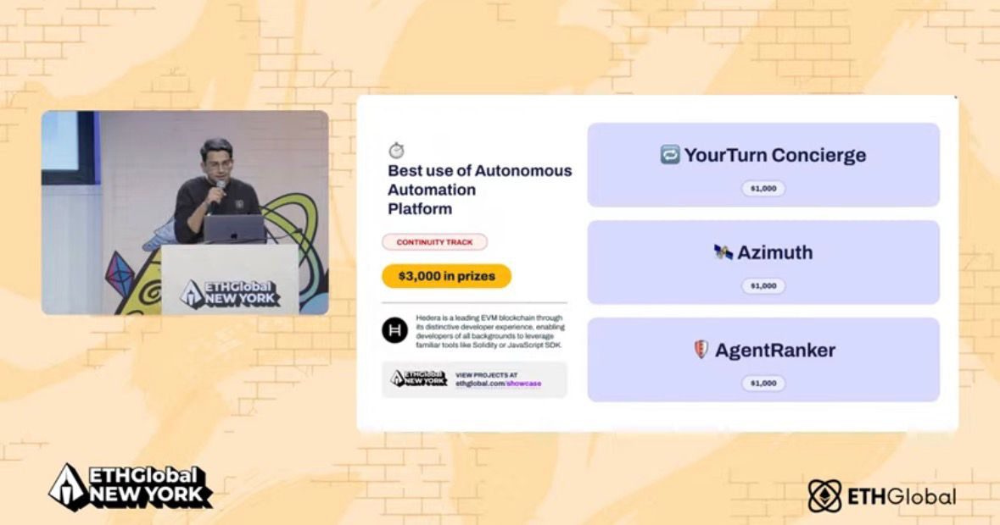

# ETHGlobal NYC 2026 Postmortem: YourTurn Concierge

Status: submitted and awarded.

Award: Best use of Autonomous Automation Platform, Continuity Track, $1,000 USDC.



## Outcome

YourTurn Concierge won Hedera's Autonomous Automation Platform category by proving one narrow, judge-legible loop:

```txt
owner recovery rules
-> Person A holds a tokenized booking right
-> Person A cannot attend
-> Concierge previews recovery economics
-> Person A approves
-> Hedera records the recovery action with Schedule Service / audit / HashScan proof
```

The strongest part of the submission was not that the app had many features. It was that the demo tied a human problem to a Hedera-native proof path:

- owners keep control over booking recovery rules
- customers recover value from bookings they cannot use
- the Concierge acts only inside policy and approval boundaries
- Hedera provides the token, schedule, audit, and verifier layer

## What We Did Right

### 1. We found a human problem before defending the tech

The winning story was easy to understand: missed classes and appointments are perishable, but the customer still paid for a scarce slot. The owner also needs policy control. Tokenized booking rights made that recovery path concrete.

### 2. We eventually centered one anchor flow

The project became competitive once the demo narrowed to:

```txt
Person A cannot attend -> recover booking -> approve listing/refund -> show Hedera proof
```

Before that, the work drifted across premium UI, Telegram, wallet funding, OpenClaw/x402, owner dashboards, scripts, and proof-pack polishing. The winning state came from making the recovery loop the product spine.

### 3. Sponsor tech became load-bearing

Hedera was not decorative in the final proof:

- HTS represented booking rights.
- Schedule Service proved the automation path.
- HCS / audit artifacts recorded recovery events.
- Mirror Node / HashScan made verification judge-visible.
- Agent Kit capability/runtime proof framed the Concierge as a bounded agent surface.
- Testnet HBAR movement supported the refund/release proof.

### 4. Claim boundaries helped credibility

The repo separated live, configured, descriptor-only, and roadmap claims. This mattered because we could answer questions without pretending that wallet-funded budgets, OpenClaw ACP gateway settlement, or x402 facilitator-backed settlement were fully live.

### 5. Telegram made the user job obvious

The bot worked because it mapped to a real user sentence: "I cannot attend." The final command language improved only after we stopped talking in refs and started explaining booking numbers, `/bookings`, `recover`, `approve listing`, and `approve refund`.

### 6. The final proof packet made the repo judge-readable

The strongest public surfaces were:

- `README.md`
- `docs/ethglobal-nyc-2026/HEDERA-QUALIFICATION-DEFENSE.md`
- `docs/ethglobal-nyc-2026/HEDERA-BOUNTY-MAP.md`
- `docs/ethglobal-nyc-2026/HEDERA-AGENT-KIT-INTEGRATION.md`
- `docs/ethglobal-nyc-2026/CAPABILITY-STATUS.md`
- `docs/ethglobal-nyc-2026/FINAL-PROOF-PACK.md`

## What We Did Wrong

### 1. We relearned the proof-gate lesson too late

We spent too much time on safe polish and route UX before forcing the question:

```txt
What live Hedera state changes will a judge see?
```

Future hackathon work should ask this in the first hour, not after the demo shell is polished.

### 2. We let wave planning become too conservative

Several early waves were useful but thin. The user had to push back that we were not moving toward the meat of the Hedera bounties quickly enough. Future agents should treat this as a drift signal:

```txt
If the wave does not create sponsor proof, user proof, or demo proof, it is probably not the next wave.
```

### 3. Demo refs and state drifted repeatedly

The final demo depended on live booking numbers. We had `193/194`, then `199/200/201`, then `208/209/210`. This created avoidable stress and script mismatch.

Future rule:

```txt
Before recording or presenting, run a live-state check and rewrite the demo refs in one place.
```

### 4. The script was not treated as an executable contract early enough

The script initially sounded polished but did not match what the user was clicking or seeing. It was too long, not sequential, and did not explain visible numbers.

Future rule:

```txt
A demo script must have: screen -> action -> visible state -> spoken line.
```

If the spoken line cannot be tied to the current screen, cut or rewrite it.

### 5. We almost buried the story under proof surfaces

The product had Telegram, in-app receipts, HashScan links, agent endpoints, docs, screenshots, and preflight output. All were useful, but the demo needed one sentence:

```txt
Person A cannot attend; YourTurn recovers the booking under owner rules and proves it on Hedera.
```

Future demos should lead with the human job, then reveal proof.

### 6. Public/private boundaries needed more discipline

The user correctly pushed back when private scripts or internal planning risked becoming public artifacts. Future agents must keep:

- public docs: setup, architecture, claims, proof, limitations
- private docs: narration, internal debate, stale refs, raw operating notes

### 7. We did not rotate secrets immediately after live testing

The Telegram bot token was pasted into chat during the rush. The project used allowlists and mutation gates, but post-demo token rotation should be a mandatory closeout step.

## Repeatable Winning Pattern

For future hackathons, use this order:

1. **Category and sponsor requirements**: What exactly can win?
2. **Human pain**: What does a normal user understand in five seconds?
3. **Primitive**: What is the new mechanism?
4. **Proof object**: What artifact or transaction proves it?
5. **Verifier**: What can judges inspect without trusting us?
6. **Anchor flow**: What is the 90-180 second loop?
7. **Sponsor fit**: What breaks if sponsor tech is removed?
8. **Demo script as contract**: Every line maps to screen state.
9. **Public proof packet**: Repo explains claims without overclaiming.
10. **Live-state rehearsal**: Check refs, links, routes, and credentials right before judging.

## New Guardrails For Future Agents

### Discovery / Inference / Facts / Next Steps

Use this whenever the user says we are drifting, asks for doctrine, or asks why a plan is not moving the needle.

- **Discovery**: what we observed from repo, docs, browser, rules, or judges
- **Inference**: what we think it means
- **Facts**: what is verified and current
- **Next steps**: smallest action that improves proof or demo clarity

### No More Thin Waves

Every wave must declare which gate it improves:

- proof gate
- sponsor-fit gate
- UX clarity gate
- demo reliability gate
- repo judge-readability gate

If it does not improve a gate, it is backlog, not a wave.

### Live Demo State Is A First-Class Artifact

Before presentation:

- verify current production refs
- verify active demo user state
- verify Telegram webhook
- verify agent endpoints
- verify HashScan links
- update private script refs
- avoid Start over unless you will rewrite the script

### Agent Claims Must Be Precise

Use:

```txt
bounded, policy-checked, human-approved Concierge agent
```

Do not imply:

```txt
fully autonomous wallet-funded user agent
```

Unless wallet-funded autonomy is actually live.

## Post-Event Actions

- Rotate Telegram bot token.
- Preserve the submitted branch and Vercel deployment as the award snapshot.
- Keep this postmortem linked from the ETHGlobal packet.
- Promote the lessons into Hackathon OS and AgentOps so future threads do not relearn the same operating mistakes.

