# Premium UX competitor research

Status: research packet for ETHGlobal NYC 2026 continuity planning.
Last checked: 2026-06-13.

This packet treats the Grok output as a hypothesis list, not source truth. The facts below come from official ClassPass and Mindbody pages plus local browser captures where access allowed it.

## Discovery

We are not trying to build a crypto-first booking app. We are trying to make YourTurn feel like a mature fitness, wellness, and appointment marketplace where Hedera is the invisible power layer behind ownership, policy automation, resale/release, agent approvals, and proof.

The two strongest references split the market:

- ClassPass is the consumer marketplace and membership pattern: discovery, credits, class cards, simple booking, flexible routine, app-first convenience, and partner inventory optimization.
- Mindbody is the owner operating system pattern: scheduling, booking, payments, staff, marketing, reporting, branded apps, consumer marketplace distribution, and business dashboards.

YourTurn should combine those two spines:

- Booker-facing: ClassPass-grade discovery, reservation, ticket, waitlist, and recovery.
- Owner-facing: Mindbody-grade inventory, policies, schedules, analytics, and operational control.
- Hedera-facing: proof, tokenized booking rights, scheduled transactions, HCS audit trails, and payment/transfer receipts shown only when useful.

## Screenshot evidence

Screenshots are stored under:

`output/playwright/ethglobal-ux-research-2026-06-13/`

Full journey captures are mapped in `COMPETITOR-JOURNEY-SCREENSHOT-MAP.md` and stored under:

`output/playwright/ethglobal-ux-research-2026-06-13/journey/`

| Target | Screenshot | Result |
| --- | --- | --- |
| ClassPass home desktop | `classpass-home-chrome-fullpage.png` | Captured successfully through Chrome extension |
| ClassPass credits/features desktop | `classpass-features-chrome-fullpage.png` | Captured successfully through Chrome extension |
| ClassPass plans desktop | `classpass-plans-chrome-fullpage.png` | Captured successfully through Chrome extension |
| ClassPass partners desktop | `classpass-partners-chrome-fullpage.png` | Captured successfully through Chrome extension |
| ClassPass search/listings desktop | `classpass-search-chrome-fullpage.png` | Captured successfully through Chrome extension |
| ClassPass home in-app browser | `classpass-home-iab-fullpage.png` | Captured successfully through Codex in-app browser |
| ClassPass logged-in search | `classpass-logged-search-fullpage.png` | Captured successfully through Chrome extension; no account settings screenshot |
| ClassPass logged-in studio detail | `classpass-logged-studio-detail-fullpage.png` | Captured successfully through Chrome extension; read-only |
| ClassPass logged-in class detail | `classpass-logged-class-detail-fullpage.png` | Captured successfully through Chrome extension; no reserve/checkout action taken |
| ClassPass headless fallback captures | `classpass-*-desktop.png`, `classpass-home-mobile.png` | Headless Playwright was served Cloudflare "Just a moment"; keep only as access-limit evidence |
| Mindbody home desktop | `mindbody-home-desktop.png` | Captured successfully |
| Mindbody pricing desktop | `mindbody-pricing-desktop.png` | Captured successfully |
| Mindbody app for businesses desktop | `mindbody-app-desktop.png` | Captured successfully |
| Mindbody explore desktop | `mindbody-explore-desktop.png` | Captured successfully |
| Mindbody home mobile | `mindbody-home-mobile.png` | Served rate-limit / "Just a moment"; not useful as UX evidence |

ClassPass full-page screenshots were blocked only in headless Playwright. The Chrome extension and Codex in-app browser captures succeeded for public pages. Logged-in access was used only for read-only marketplace, studio, and class-detail pages. Account settings were not screenshotted.

## Facts

### ClassPass

Official pages checked:

- https://classpass.com/
- https://classpass.com/features
- https://classpass.com/plans
- https://classpass.com/partners/how-it-works
- https://classpass.com/partners/blog/classpass-payouts-pricing-policies-rates

Observed facts:

- The top-level consumer promise is "one app" for fitness, wellness, beauty, gyms, salons, and related experiences.
- The consumer navigation prioritizes search, plans, how it works, gifts, business listing, corporate wellness, login, and free trial.
- The public search page renders a mature marketplace listing: location-based heading, studio result cards, ratings/review counts, category labels, distance/area context, and a membership upsell section.
- In the logged-in-but-incomplete session, navigation changed to include Videos, Find classes & appointments, Account, and Log out while still showing signup/trial calls to action.
- The logged-in search page included a date/time-oriented class marketplace: live sessions for the current day, sections for classes and studios, filters for activity/date/time/more, and class cards with studio links, rating counts, and pricing/signup prompts.
- The studio detail page uses a complete venue profile: studio name, schedule, reviews, activity tags, preparation guidance, highlights, amenities, directions, contact links, similar studios, and a schedule tab.
- The class detail page uses a specific class/event framing: class title at studio, reviews, related schedule entries, cancellation-policy help link, venue address/map link, phone, website, and social link.
- The logged-in session showed an updated-terms prompt. We did not accept terms, complete signup, reserve a class, or enter checkout.
- The consumer model is credit-based. Credits book classes or appointments, and required credits vary by reservation type, location, popularity, and time.
- ClassPass explains membership through concrete routines and credit budgets, not technical mechanics.
- The plans page frames membership as lifestyle fit first, then credits and price. It includes FAQ coverage for reservation cancellation, missed reservations, running out of credits, and unused credits.
- The partner pitch is incremental revenue: fill open spots with high-intent customers.
- Partner onboarding steps are simple: sign up with no upfront cost, build a profile, sync booking system, add photos/descriptions/services/amenities, then grow.
- Partner optimization tools include SmartSpot and SmartRate. SmartSpot lists spots less likely to be filled directly; SmartRate optimizes credit amounts to improve incremental revenue.
- Partner claims include no upfront cost, no ongoing fixed fee to remain listed, and bi-weekly or monthly direct deposit payments depending on the agreement.
- ClassPass positions its members as younger, variety-seeking, often more price-sensitive than direct clients, but highly engaged.

### Mindbody

Official pages checked:

- https://www.mindbodyonline.com/
- https://www.mindbodyonline.com/business/pricing
- https://www.mindbodyonline.com/business/mindbody-app
- https://www.mindbodyonline.com/explore

Observed facts:

- Mindbody is owner-first: business management software for fitness, beauty, and wellness.
- The core business feature stack includes payments, marketing, staff management, booking, scheduling, reporting, and branded apps.
- Mindbody uses scale as trust: more than 40,000 businesses and more than 600 million classes and appointments booked in the prior year.
- Business pricing starts with a plan that includes business management tools, integrated payments, branded website booking widgets, Mindbody app listing, and basic reporting.
- The business app marketplace page emphasizes 3M+ active users, new client discovery, seamless booking, dynamic pricing, reviews, and marketplace revenue.
- Owner-side revenue tracking is framed as a dashboard where earnings from new clients, promoted intro offers, and more can be tracked.
- Reviews are not just consumer trust; Mindbody frames them as marketplace visibility and owner brand-building.

## Inferences

### What makes the experience feel mature

The mature feel does not come from more technical features. It comes from a stable product spine:

- Clear inventory: every class, slot, instructor, time, location, and policy is concrete.
- High-quality presentation: real venue photos, strong class names, instructor metadata, ratings, badges, and concise copy.
- Obvious economics: credits, price, budget, refund/release policy, and owner payout status are visible at the right moment.
- Repeat workflows: browsing, booking, calendar, ticket, cancel/reschedule, waitlist, and owner reporting are normalized.
- Hidden complexity: the user sees a reservation and receipt; the chain proof is a drawer, receipt footer, or owner audit view.
- Owner confidence: owner controls supply, policy, resale/release rules, visibility, and dashboards.

### What YourTurn should copy in spirit

From ClassPass:

- Search-first discovery with rich cards.
- Credit/budget language for consumers.
- Simple "book / reserve" CTA.
- Membership or budget framing through examples.
- Partner onboarding that sounds low-risk.
- Dynamic inventory and pricing controls, but explained as revenue protection.

From Mindbody:

- Owner dashboard seriousness.
- Booking, scheduling, payment, reporting, and branded-profile primitives.
- Marketplace listing as distribution.
- Reviews and ratings as trust and visibility.
- Analytics surfaces that answer "what happened and what did I earn?"

What we should not copy:

- Generic marketing pages as the main hackathon demo.
- Blockchain vocabulary in the first user sentence.
- A feature list without a strong booking recovery flow.
- A dashboard that only shows chain transactions without the service job.

## Recommended YourTurn spine

```mermaid
flowchart LR
  Owner["Owner sets inventory and policy"] --> Slots["Tokenized booking slots"]
  Slots --> Discover["Booker discovers and books"]
  Discover --> Ticket["Ticket, QR, receipt, policy snapshot"]
  Ticket --> Concierge["Concierge recovery flow"]
  Concierge --> Choice["Reschedule, release, waitlist offer, or resale"]
  Choice --> Hedera["Hedera proof: HTS, HCS, Schedule Service"]
  Hedera --> Dash["Owner and booker proof views"]
```

### Booker surfaces

1. Discover
   - Location, date, category, price/budget, availability, and owner policy filters.
   - Cards show venue photo, class title, instructor, time, distance, rating, price/credits, and a compact policy badge.

2. Class or slot detail
   - Hero image, venue trust, instructor, schedule, capacity, cancellation/release policy, resale eligibility, waitlist state, and reserve CTA.
   - Hedera proof should be a secondary trust drawer, not the main headline.

3. Checkout / reserve
   - Show cost, budget impact, policy snapshot, and what the agent can or cannot do later.
   - For demo mode, use a funded Hedera testnet budget account and label it clearly.

4. My bookings
   - Upcoming, waitlisted, listed for resale, released, attended, and expired states.
   - Each booking should have a clear next action: show ticket, ask Concierge, reschedule, list, release, transfer, or view proof.

5. Ticket
   - QR code, time, location, check-in status, owner policy at purchase, proof receipt, and support/recovery action.

6. Concierge
   - Plain-language chat with structured action cards.
   - The agent should recommend allowed actions, explain consequences, ask for explicit approval, execute, then return proof.

7. Venue and class detail depth
   - Mirror ClassPass depth: venue profile, schedule, reviews, class-specific detail, cancellation policy, instructor/staff context, preparation notes, amenities, directions, and related classes.
   - YourTurn difference: add owner policy snapshot, transferability, resale/release eligibility, and Hedera verified receipt as quiet trust surfaces.

### Owner surfaces

1. Business onboarding
   - Profile, location, photos, service types, staff/instructors, and schedule source.

2. Inventory setup
   - Recurring class templates, individual slots, capacity, price/credit, and visibility.

3. Policy builder
   - Templates for release, refund, resale, waitlist, transfer, and no-show.
   - Each booking receives a policy snapshot at purchase.

4. Automation setup
   - Hedera Schedule Service should be framed as "network-executed actions" or "automatic policy execution," not as a chain primitive.

5. Dashboard
   - Occupancy, revenue, upcoming schedules, pending approvals, waitlist demand, resale activity, executed automations, and audit receipts.

6. Proof and audit
   - Owner can inspect transaction IDs, HCS lifecycle events, policy versions, and scheduled transaction status when needed.

## Premium UX doctrine for this hackathon

1. Lead with the service job, not Web3.
   - Say "Recover value from a booking you cannot use."
   - Do not say "NFT ticket marketplace" as the first explanation.

2. Make owners feel in control.
   - Owners set which slots can be rescheduled, released, transferred, or resold.
   - Owners see policy versions and proof, but do not need to understand Hedera internals to use the product.

3. Make bookers feel protected.
   - Bookers see what they bought, what policy applies, what options exist, and what the agent needs approval to do.

4. Keep proof visible but calm.
   - Use labels like "Verified receipt," "Policy snapshot," "Network executed," and "Audit trail."
   - Put transaction IDs and HashScan links behind a details drawer.

5. Use visual polish where it matters.
   - Real class/studio photography.
   - Dense but readable cards.
   - Strong mobile booking states.
   - Consistent CTA hierarchy.
   - Small badges for transferable, resale allowed, waitlist active, auto-release, and verified.

6. Do not build a crypto cockpit.
   - Technical state belongs in proof drawers, owner audit views, and demo debug panels.
   - The primary app should look like a premium booking service.

## Missing layers in the current YourTurn experience

These are the product layers that would make the app feel closer to ClassPass/Mindbody without expanding scope too much.

| Layer | Why it matters | Hackathon priority |
| --- | --- | --- |
| Marketplace-style browse | Makes the app feel real before the demo action begins | High |
| Venue/class cards | Needed for visual legitimacy and fast comprehension | High |
| Booker "My bookings" | Gives Concierge something concrete to operate on | High |
| Ticket / QR / receipt view | Makes tokenized booking rights tangible | High |
| Owner policy builder | Shows the source of automation and user protections | High |
| Policy snapshot on booking | Prevents confusing policy changes after purchase | High |
| Recovery action cards | Converts chat output into clear approved actions | High |
| Waitlist/resale state | Makes Booker A / Booker B demo coherent | Medium |
| Venue profile depth | ClassPass/Mindbody make the venue feel real through photos, ratings, amenities, directions, contact surfaces, and related listings | Medium |
| Date/time filters | Logged-in ClassPass search is organized around what can be booked today or next | Medium |
| Owner analytics | Makes the owner side feel operational, not demo-only | Medium |
| Reviews/ratings | Adds marketplace trust, but can be seeded for demo | Low |
| Full fiat/on-ramp | Useful later; too risky for the first working wave | Low |

## Build waves

### UX wave 1: premium app shell

Create a production-grade first impression without changing the core Hedera flow:

- Top navigation: Discover, My bookings, Concierge, Owner studio.
- Role switcher for demo: Owner, Booker A, Booker B.
- Realistic studio/class sample data.
- Card grid and detail page with premium photos and compact metadata.
- "Verified by Hedera" trust badge that opens proof details.

### UX wave 2: owner policy and inventory

Build the owner source-of-truth flow:

- Owner creates a slot or recurring class.
- Owner sets release/resale/waitlist policy.
- UI shows that new bookings will snapshot this policy.
- Dashboard shows inventory, booked rights, pending waitlist, and automation status.

### UX wave 3: booker recovery

Build the strongest hackathon story:

- Booker A has a booked slot and cannot attend.
- Concierge reads the booking, policy, and availability.
- Concierge recommends release/reschedule/resale/waitlist transfer options.
- Booker A approves one action.
- Hedera testnet action executes and returns receipt.
- Booker B sees availability or waitlist claim path.

### UX wave 4: Schedule Service proof

Add the Continuity Track Hedera automation claim:

- Owner configures a future or conditional scheduled action.
- User-facing UI creates, approves, and manages the schedule.
- The network executes one testnet scheduled transaction.
- Owner dashboard shows scheduled, approved, executed, and receipt states.

### UX wave 5: Telegram Concierge

Make the agent demo memorable:

- Telegram asks "What can I do with my 6:30 Pilates booking?"
- Concierge replies with current booking state and allowed options.
- User approves.
- Telegram receives proof receipt and app link.
- App shows updated ticket/recovery state.

## Demo recommendation

The most competitive demo should not try to show every feature. It should show one premium loop:

1. Owner publishes a premium class and policy.
2. Booker A reserves a tokenized slot.
3. Booker A cannot attend and asks Concierge for help.
4. Concierge proposes a policy-valid action and requests approval.
5. Hedera executes or records the lifecycle action.
6. Booker B claims the newly available or resale slot.
7. Owner dashboard shows the policy, revenue/state change, and proof.

This lets us say:

- ClassPass gives users flexible access.
- Mindbody gives owners operational software.
- YourTurn adds ownership, programmable recovery, agent assistance, and Hedera proof.

## Unknowns

- ClassPass headless Playwright screenshots were blocked by Cloudflare, but Chrome extension and in-app browser captures succeeded for public pages.
- Logged-in ClassPass consumer and studio dashboards were not inspected. Use Chrome only after explicit user approval for the exact account/session flow.
- Logged-in Mindbody owner dashboards were not inspected.
- Exact current mobile app flows were not inspected.
- Claims about competitors beyond ClassPass and Mindbody remain secondary until separately sourced.
- Wallet connection, fiat on-ramp, and real-money refund UX are out of scope until the working demo flow is stable.
