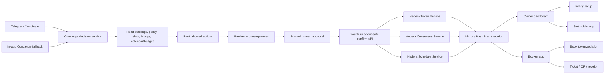
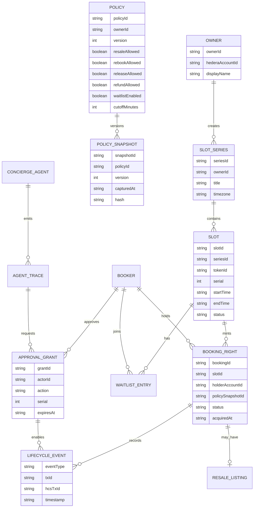
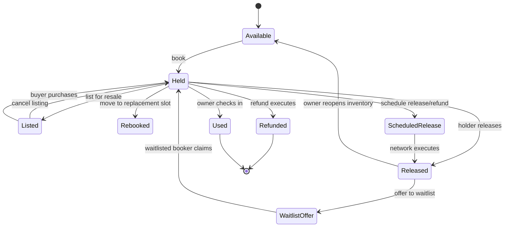
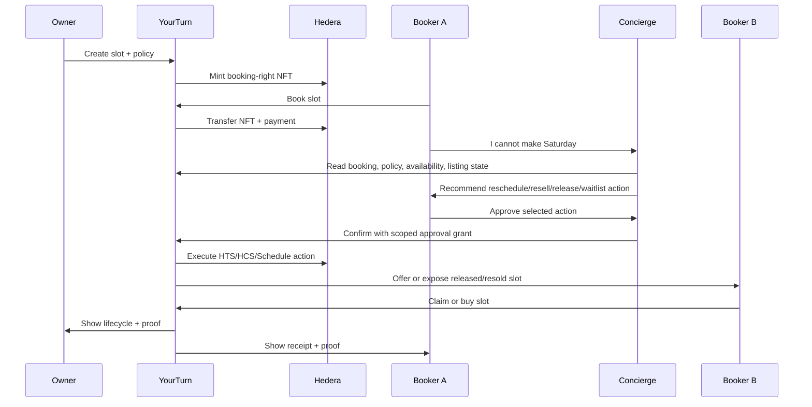

# YourTurn Concierge Technical Blueprint

Date: 2026-06-13
Status: implementation map before next build wave

## Current Baseline

Existing repo capabilities:

- Next.js 14 App Router
- TypeScript
- Hedera SDK in server-side routes
- HTS booking-right NFTs
- HTS resale royalty
- HCS lifecycle events
- Mirror reads
- Redis demo state
- agent-safe read/preview/approval/confirm APIs

Recent addition:

- agent-safe `cancel_release` action exists in the API surface
- it transfers the NFT back to treasury, burns it, clears any active listing, emits `CANCEL_RELEASED`, and returns proof tx ids
- it is not yet a browser UI, refund, Telegram bot, waitlist, Schedule Service, or budget-agent flow

## Target Architecture



Execution authority stays server-side in YourTurn. Telegram/OpenClaw is ingress and approval surface, not key custody.

## Data Model Draft



Hackathon implementation can use the existing Redis/demo structures first. The data model defines the intended boundaries so we do not confuse demo state with trust-critical state.

## Booking Lifecycle



Current app statuses are simpler: `AVAILABLE`, `HELD`, `FROZEN`, `USED`. Add richer states only when the UI and proof path need them.

## Primary User Flow



## Owner Flow

Minimum owner surfaces:

1. Create or view slot inventory.
2. Set policy in plain language:
   - resale allowed
   - reschedule allowed
   - release allowed
   - refund allowed
   - waitlist enabled
   - cutoff window
3. Publish slots.
4. Inspect lifecycle events and proof.
5. See automated or Concierge-assisted actions.

Policy snapshot rule:

- When Booker A buys, store the policy version/hash with that booking.
- Future policy changes apply to future bookings by default.

## Booker Flow

Minimum booker surfaces:

1. Book slot.
2. See ticket, QR, receipt, proof.
3. Ask Concierge for help:
   - "I cannot make Saturday"
   - "Find me another class"
   - "Can I resell this?"
   - "Join the waitlist"
4. Review recommendation.
5. Approve action.
6. See status/proof.

## Concierge Decision Loop

```txt
intent -> identify booking/user -> read policy snapshot -> read live state -> read alternatives -> rank allowed actions -> preview -> approval -> execute -> receipt
```

Ranked action examples:

- If replacement slot exists and rebook is allowed: recommend reschedule.
- If no replacement exists and resale is allowed: recommend resale.
- If waitlist exists and release is allowed: recommend release to waitlist.
- If refund is allowed and treasury is funded: recommend refund.
- If no action is allowed: explain blocked reason and show owner policy.

## Proof Object

Each Concierge action should produce a receipt like:

```json
{
  "receiptId": "recovery_2026_06_13_001",
  "actor": "guestA",
  "agent": "yourturn-concierge",
  "intent": "I cannot make Saturday",
  "booking": {
    "tokenId": "0.0.x",
    "serial": 1,
    "policySnapshotId": "policy_v1_hash"
  },
  "recommendation": {
    "selectedAction": "reschedule",
    "alternatives": ["resell", "release"],
    "reason": "replacement slot available before cutoff"
  },
  "approval": {
    "grantId": "grant_x",
    "approvedAt": "2026-06-13T00:00:00.000Z",
    "expiresAt": "2026-06-13T00:10:00.000Z"
  },
  "protocolRefs": {
    "htsTxId": "0.0.x@...",
    "hcsTxId": "0.0.x@...",
    "scheduleId": "0.0.x",
    "scheduledTxId": "0.0.x@..."
  },
  "verifier": {
    "status": "passed",
    "checks": [
      "policy_allows_action",
      "approval_matches_actor_action_serial",
      "mirror_state_changed",
      "hcs_event_exists"
    ]
  }
}
```

## Build Waves

### Wave 0: Doctrine And Baseline

Goal:

- Lock doctrine, claims, language, and proof gates.

Exit criteria:

- Doctrine and technical blueprint exist.
- Build scope is agreed.
- Existing dirty worktree is understood.

### Wave 1: Owner Policy + Booker Recovery

Goal:

- Owner policy visible.
- Booker A owns a booking.
- Concierge can recommend and execute one recovery action.

Implementation:

- Add policy snapshot field/path where feasible.
- Add Concierge recommendation function over existing agent-safe APIs.
- Use existing `cancel_release` or resale listing as the first real execution.
- Emit or surface HCS proof.

Exit criteria:

- One end-to-end recovery receipt exists.
- `npm run build` passes.
- Demo docs updated.

### Wave 2: Reschedule / Waitlist

Goal:

- Make the user value clearer than cancel-only.

Implementation:

- Add replacement slot selection.
- Add waitlist entries and offer state.
- Concierge can say "take this Tuesday slot" or "offer this released slot to Booker B."

Exit criteria:

- Booker A changes outcome.
- Booker B can claim or buy a slot made available by policy.

### Wave 3: Hedera Schedule Service

Goal:

- Qualify for Automation track with real network scheduling.

Implementation:

- Standalone Schedule Service spike.
- Server-side schedule adapter.
- Store schedule id and scheduled tx id.
- UI proof for pending/executed schedules.

Exit criteria:

- Real schedule id on testnet.
- Real scheduled transaction execution.
- Receipt verifies schedule proof.

### Wave 4: Telegram Concierge

Goal:

- Make the product happen where the booker already talks.

Implementation:

- Telegram bot or OpenClaw-style ingress.
- Link Telegram user to demo account/booking code.
- Send options and approval buttons.
- Confirm through YourTurn server-side API.

Exit criteria:

- Telegram request produces same proof receipt as in-app flow.
- Telegram does not hold keys.
- Unsafe text cannot construct arbitrary txs.

### Wave 5: Budgeted Agent Booking

Goal:

- Strong Agentic Payments stretch.

Implementation:

- Demo-funded budget account or real capped allowance.
- User sets budget, constraints, and time windows.
- Concierge books only within budget and owner policy.

Exit criteria:

- Budget decreases or allowance is consumed on Hedera.
- Agent decision trace shows constraints.
- User can inspect what happened and why.

## Technical Gates

Before claiming a feature:

- live: does the action happen in app or Telegram?
- artifact: is there a receipt, tx id, HCS event, or screenshot?
- verifier: can a script or page check it?
- sponsor: does Hedera do something load-bearing?
- limitation: is the missing part named honestly?

## Current Open Decisions

1. Which recovery action becomes Wave 1 primary: resale, release, or reschedule?
2. Do we model policy snapshots in Redis first, or as HCS commitments immediately?
3. Does waitlist need to be live for the video, or can it be explained as Wave 2 after resale/release works?
4. Do we build Telegram before or after a stable in-app Concierge?
5. Is budgeted booking a stretch or must-have for submission?

## Recommended Next Implementation

Implement Wave 1 narrowly:

1. Add plain owner policy object and policy snapshot to slot/booking demo state.
2. Add a Concierge recommendation endpoint/function that reads a held booking and returns ranked actions.
3. Use the existing agent-safe approval/confirm path for one action.
4. Generate a recovery receipt JSON.
5. Show receipt/proof in app before Telegram.

Then add Telegram as a transport over the same flow.
